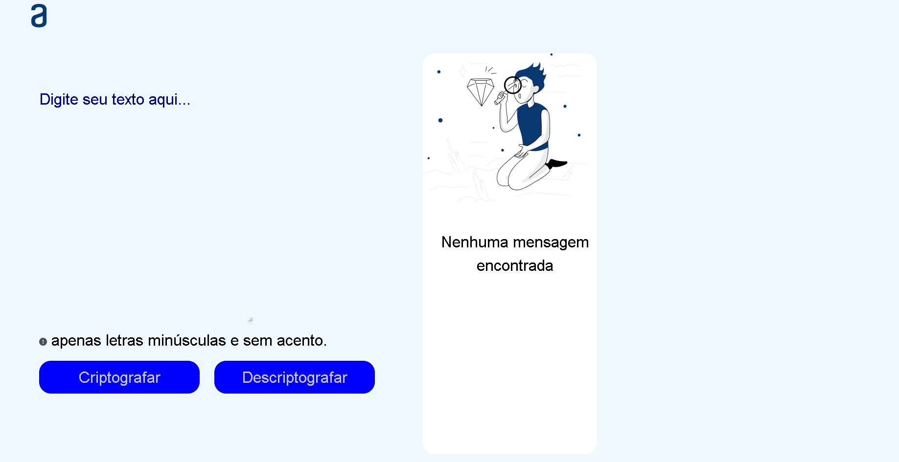

<h1 align="center">Projeto decodificador de texto</h1>

<h3 align="center">Nesse projeto criamos um encriptador de texto, utilizamos uma logica para substituir as vogais por palavras especificas.</h3>

<h3>Tecnologias utilizada:</h3>

<ul>
  <li> JavaScript</li>
  <li> HTML</li>
  <li> CSS</li>
</ul>

<h4>Contatos: </h4>

LinkedIn: www.linkedin.com/in/aleph-fernandes/

GitHub: https://github.com/AleephF

<h3 align="center">Tela do projeto:</h3>

